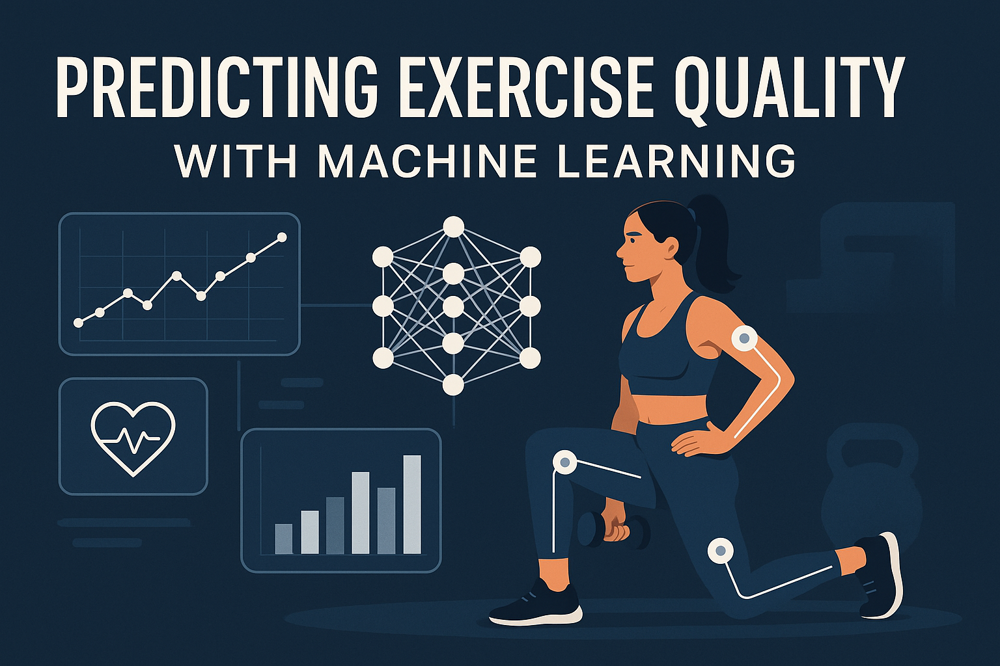

# Predicting Exercise Quality with Machine Learning
# Predição da Qualidade de Exercícios com Machine Learning

  

This project uses machine learning techniques to classify the quality of weightlifting exercises based on accelerometer data positioned on different parts of the body (belt, forearm, arm, and dumbbell).

Este projeto utiliza técnicas de machine learning para classificar a qualidade de exercícios de levantamento de peso com base em dados de acelerômetro posicionados em diferentes partes do corpo (cinto, antebraço, braço e haltere).

## Overview
## Visão Geral

The goal of this project is to predict how well a weightlifting exercise is being performed. The data was collected from sensors on gym equipment used by six participants, who performed the weightlifting exercise in five different ways:

O objetivo deste projeto é prever o quão bem um exercício de levantamento de peso está sendo realizado. Os dados foram coletados de sensores em equipamentos de ginástica usados por seis participantes, que realizaram o exercício de levantamento de peso de cinco maneiras diferentes:

- Class A: Correct execution of the exercise
- Classe A: Execução correta do exercício
- Class B: Elbows forward
- Classe B: Cotovelos para frente
- Class C: Partial lifting of the dumbbell
- Classe C: Levantamento parcial do haltere
- Class D: Partial lowering of the dumbbell
- Classe D: Abaixamento parcial do haltere
- Class E: Hips thrust forward
- Classe E: Quadril projetado para frente

## Repository Contents
## Conteúdo do Repositório

- `prediction_report.Rmd`: R Markdown code with complete analysis
- `prediction_report.Rmd`: Código R Markdown com análise completa
- `prediction_report.html`: HTML report generated from R Markdown
- `prediction_report.html`: Relatório HTML gerado a partir do R Markdown
- `pml-training.csv`: Training dataset
- `pml-training.csv`: Conjunto de dados de treinamento
- `pml-testing.csv`: Testing dataset
- `pml-testing.csv`: Conjunto de dados de teste

## Methodology
## Metodologia

The project follows these steps:

O projeto segue estes passos:

1. **Data Preparation**: Loading and cleaning data, removing columns with many missing values
1. **Preparação de Dados**: Carregamento e limpeza de dados, remoção de colunas com muitos valores ausentes
2. **Preprocessing**: Removing metadata columns and converting variables
2. **Pré-processamento**: Remoção de colunas de metadados e conversão de variáveis
3. **Model Building**: Implementing Random Forest for classification
3. **Construção do Modelo**: Implementação de Random Forest para classificação
4. **Evaluation**: Performance analysis using confusion matrix and accuracy metrics
4. **Avaliação**: Análise de desempenho usando matriz de confusão e métricas de acurácia
5. **Prediction**: Applying the model to test data
5. **Predição**: Aplicação do modelo aos dados de teste

## Technologies Used
## Tecnologias Utilizadas

- R
- R
- Libraries: caret, randomForest, ggplot2, dplyr
- Bibliotecas: caret, randomForest, ggplot2, dplyr

## Results
## Resultados

The Random Forest model achieved excellent accuracy in classifying exercise quality. The main predictors were movement patterns captured by the belt and forearm sensors.

O modelo Random Forest alcançou excelente acurácia na classificação da qualidade do exercício. Os principais preditores foram os padrões de movimento capturados pelos sensores do cinto e do antebraço.

## How to Run
## Como Executar

1. Clone this repository
1. Clone este repositório
2. Open the `prediction_report.Rmd` file in RStudio
2. Abra o arquivo `prediction_report.Rmd` no RStudio
3. Install the necessary dependencies (caret, randomForest, ggplot2, dplyr)
3. Instale as dependências necessárias (caret, randomForest, ggplot2, dplyr)
4. Run the code to reproduce the analysis
4. Execute o código para reproduzir a análise

## Author
## Autor

Gabriel Demetrios Lafis

## License
## Licença

MIT

