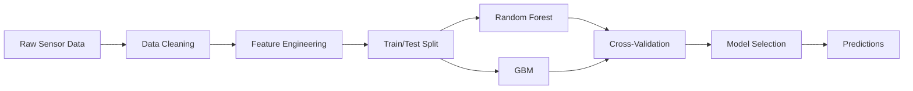

<div align="center">

# Weight Lifting Exercise Prediction | Predição de Exercícios de Levantamento de Peso

[](https://www.r-project.org/)
[](https://rmarkdown.rstudio.com/)
[](LICENSE)
[](Dockerfile)

**Machine Learning pipeline for Human Activity Recognition (HAR) using wearable sensor data**

[English](#english) | [Português](#português)

</div>

---

## English

### Overview

A complete machine learning pipeline for predicting the quality of weight lifting exercises using accelerometer data from wearable sensors. This project implements Random Forest and Gradient Boosting models with cross-validation to classify exercise execution into 5 quality categories (A-E), achieving high prediction accuracy on the Weight Lifting Exercise Dataset.

### Architecture



### Key Features

- **Data Pipeline**: Automated cleaning and feature extraction from accelerometer readings (belt, forearm, arm, dumbbell sensors)
- **Multi-Model Comparison**: Random Forest vs Gradient Boosted Trees with hyperparameter tuning
- **Cross-Validation**: K-fold cross-validation for robust out-of-sample error estimation
- **Reproducible Research**: Full RMarkdown report with embedded analysis and visualizations

### Tech Stack

| Technology | Purpose |
|-----------|---------|
| R 4.3+ | Statistical computing and modeling |
| caret | ML model training and tuning |
| randomForest | Ensemble classification |
| gbm | Gradient boosting |
| RMarkdown | Reproducible reporting |

### Quick Start

```bash
# With Docker
docker build -t weight-lifting-prediction .
docker run weight-lifting-prediction

# Local
Rscript -e "rmarkdown::render('src/prediction_report.Rmd', output_dir='docs/')"
```

### Industry Applications

- **Wearable Tech & IoT**: Quality assessment algorithms for fitness devices (Fitbit, Apple Watch, Garmin)
- **Healthcare**: Physical therapy monitoring and rehabilitation progress tracking
- **Sports Analytics**: Real-time exercise form correction and injury prevention systems
- **Manufacturing**: Worker ergonomics monitoring and occupational safety compliance

### Project Structure

```
├── src/
│   └── prediction_report.Rmd    # Main analysis report
├── data/                         # Training and test datasets
├── assets/                       # Visualizations and plots
├── docs/                         # Generated HTML reports
├── Dockerfile                    # Containerized R environment
├── LICENSE                       # MIT License
└── README.md
```

---

## Português

### Visão Geral

Pipeline completo de Machine Learning para prever a qualidade de exercícios de levantamento de peso usando dados de acelerômetro de sensores vestíveis. O projeto implementa modelos Random Forest e Gradient Boosting com validação cruzada para classificar a execução dos exercícios em 5 categorias de qualidade (A-E).

### Funcionalidades Principais

- **Pipeline de Dados**: Limpeza automatizada e extração de features de sensores (cinto, antebraço, braço, haltere)
- **Comparação Multi-Modelo**: Random Forest vs GBM com ajuste de hiperparâmetros
- **Validação Cruzada**: K-fold cross-validation para estimativa robusta de erro fora da amostra
- **Pesquisa Reproduzível**: Relatório RMarkdown completo com análise e visualizações integradas

### Aplicações na Indústria

- **Wearable Tech & IoT**: Algoritmos de avaliação de qualidade para dispositivos fitness
- **Saúde**: Monitoramento de fisioterapia e acompanhamento de reabilitação
- **Analytics Esportivo**: Correção de forma de exercício em tempo real e prevenção de lesões
- **Manufatura**: Monitoramento ergonômico de trabalhadores e conformidade de segurança

### Como Executar

```bash
# Com Docker
docker build -t weight-lifting-prediction .
docker run weight-lifting-prediction

# Local
Rscript -e "rmarkdown::render('src/prediction_report.Rmd', output_dir='docs/')"
```

---

## License

This project is licensed under the MIT License - see the [LICENSE](LICENSE) file for details.
